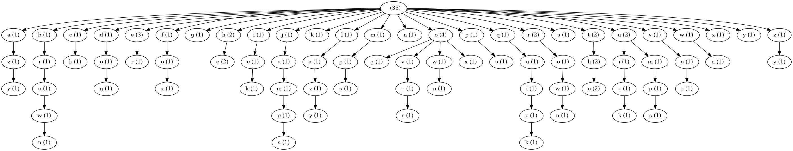

# Langg

This is a two part project, a language generator and a [Discord](https://discord.com/) bot allowing two or more people to maintain their own language and speak to each other in that language, sort of a game but not really.

This readme serves to give an overview of each.

For CLI options, please the readme in the `langg` directory ([here](./langg/README.md)).

## Usage

### Dependencies

This is a [Python3.9](https://www.python.org/) project, dependency management is done via [Poetry](https://python-poetry.org/) (which can be installed via `pip`).

Then,

```sh
poetry install
```

### Running

To see the command line options, go with:

```sh
poetry run langg --help
```

## Langg

Langg is a program written to generate a pseudo-language - really it's just English but with each word swapped out for another and there are a few rules to split/join certain words/word combinations.

It's implementation may be a little interesting to some:

1. Each dictionary starts with an empty tree
2. The user provides a dictionary of words, this can be a wordlist like [CornCob](http://www.mieliestronk.com/wordlist.html) or a literal dictionary file, or even a Japanese dictionary in Romaji, whatever you fancy as long as it's English-ish
3. For each word in the list, and for each position in that word, a branch in the tree is formed
   - If nodes for a sub-branch already exist, then the visits to that node are increased but no new node is created
   - E.g. for a "dictionary" of "the quick brown fox jumps over the lazy dog", the following tree is created
   


4. A seed is either provided for or given by the user
   - This seed is used in a RNG based of a noise function
5. The tree is traversed and based on the input text, form "syllables" based on sub-branches of their tree

And that's pretty much it, it's good fun to see what it spits out.

## Discord Bot

One idea for this project was to present it as a sort of game

- Each party provides a dictionary file and thereby generates a tree
- Parties then send messages to each other _in their language_
- From context alone, maybe some emojis in there, the other parties work out the lexicon of the other language

I really couldn't be bothered to make a chat app and host it somewhere, particularly as I assume no one will ever see this project, so I figured it might work as a Discord bot.
